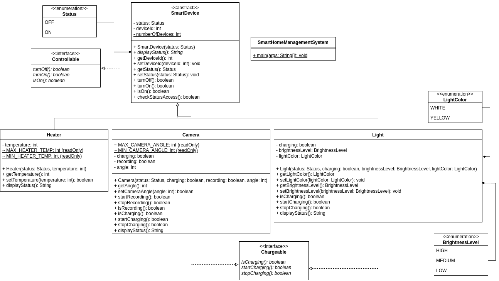
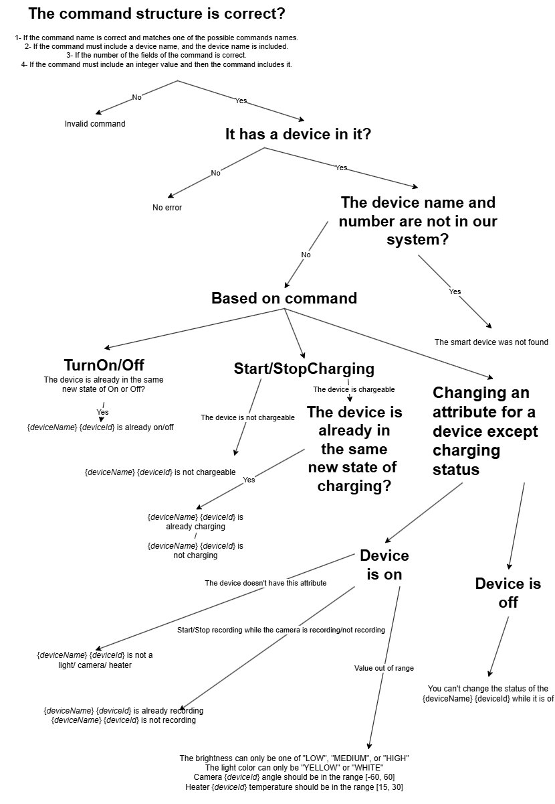

# Smart Home System

## Problem Description

The **Smart Home System** is designed to manage various smart devices: **Lights**, **Cameras**, and **Heaters**. Each device can be **activated** or **deactivated** and manipulated when in the **ON** state. Specific attributes and functionality vary per device type, as detailed below.

---

## Device States and Attributes

### **Lights**
- States: ON or OFF.
- **ON**: Brightness (`LOW`, `MEDIUM`, `HIGH`) and color (`YELLOW`, `WHITE`) can be modified.
- **OFF**: Attributes cannot be changed except for the charging status.

### **Cameras**
- States: ON or OFF.
- **ON**: Can record and adjust the camera angle (`-60°` to `60°`).
- **OFF**: Recording and angle adjustments are disabled.

### **Heaters**
- States: ON or OFF.
- **ON**: Temperature can be set within `15°C` to `30°C`.
- **OFF**: Temperature cannot be modified.

---

## Initial Device States

| Device   | Count | Initial State                          |
|----------|-------|----------------------------------------|
| Lights   | 4     | ON, brightness = LOW, color = YELLOW  |
| Cameras  | 2     | ON, angle = 45°, not recording        |
| Heaters  | 4     | ON, temperature = 20°C               |

### Device Identifiers
- **Lights**: Device IDs `0` to `3`.
- **Cameras**: Device IDs `4` and `5`.
- **Heaters**: Device IDs `6` to `9`.

---

## Commands and Descriptions

| **Command**                            | **Description**                                                                 |
|----------------------------------------|---------------------------------------------------------------------------------|
| `DisplayAllStatus`                     | Displays the current status of all devices.                                     |
| `TurnOn {deviceName} {deviceId}`       | Turns the specified device ON.                                                 |
| `TurnOff {deviceName} {deviceId}`      | Turns the specified device OFF.                                                |
| `StartCharging {deviceName} {deviceId}`| Starts charging the specified device (only for Lights and Cameras).            |
| `StopCharging {deviceName} {deviceId}` | Stops charging the specified device (only for Lights and Cameras).             |
| `SetTemperature {deviceName} {deviceId} {temperature}` | Sets heater temperature (15°C to 30°C).                       |
| `SetBrightness {deviceName} {deviceId} {brightnessLevel}` | Sets light brightness (`LOW`, `MEDIUM`, `HIGH`).              |
| `SetColor {deviceName} {deviceId} {color}` | Sets light color (`YELLOW` or `WHITE`).                                        |
| `SetAngle {deviceName} {deviceId} {angle}` | Adjusts camera angle within `-60°` to `60°`.                                   |
| `StartRecording {deviceName} {deviceId}` | Starts recording for a camera.                                                |
| `StopRecording {deviceName} {deviceId}`  | Stops recording for a camera.                                                 |
| `end`                                  | Ends the input and terminates the program.                                     |

---

## Command Outputs

### **Success Messages**

| **Action**         | **Message**                                      |
|---------------------|-------------------------------------------------|
| `TurnOn`           | `{deviceName} {deviceId} is on`                 |
| `TurnOff`          | `{deviceName} {deviceId} is off`                |
| `StartCharging`    | `{deviceName} {deviceId} is charging`           |
| `StopCharging`     | `{deviceName} {deviceId} stopped charging`      |
| `SetTemperature`   | `{deviceName} {deviceId} temperature is set to {temperature}` |
| `SetBrightness`    | `{deviceName} {deviceId} brightness level is set to {brightnessLevel}` |
| `SetColor`         | `{deviceName} {deviceId} color is set to {color}` |
| `SetAngle`         | `{deviceName} {deviceId} angle is set to {angle}` |
| `StartRecording`   | `{deviceName} {deviceId} started recording`     |
| `StopRecording`    | `{deviceName} {deviceId} stopped recording`     |

---

### **Error Messages**

| **Condition**                           | **Message**                                             |
|-----------------------------------------|---------------------------------------------------------|
| Invalid command format                  | `Invalid command`                                       |
| Non-existent device                     | `The smart device was not found`                       |
| Charging a non-chargeable device        | `{deviceName} {deviceId} is not chargeable`            |
| Setting heater temperature for non-heater | `{deviceName} {deviceId} is not a heater`            |
| Setting brightness for non-light        | `{deviceName} {deviceId} is not a light`               |
| Setting brightness out of scope         | `The brightness can only be one of "LOW", "MEDIUM", or "HIGH"` |
| Setting color for non-light             | `{deviceName} {deviceId} is not a light`               |
| Setting invalid light color             | `The light color can only be "YELLOW" or "WHITE"`      |
| Setting angle for non-camera            | `{deviceName} {deviceId} is not a camera`              |
| Setting camera angle out of range       | `Camera {deviceId} angle should be in the range [-60, 60]` |
| Device already ON/OFF                   | `{deviceName} {deviceId} is already on/off`            |
| Modifying attributes while OFF          | `You can't change the status of the {deviceName} {deviceId} while it is off` |

---

## Input Format

The input consists of one or more lines containing commands, ending with the `end` command.

**Example Input (`input.txt`):**
[link](https://drive.google.com/file/d/1ggTX_fGJxG4CtNemYRWrtrY4_UUweYFu/view?usp=drive_link)
